# kottans-frontend

Git & GitHub
------ 

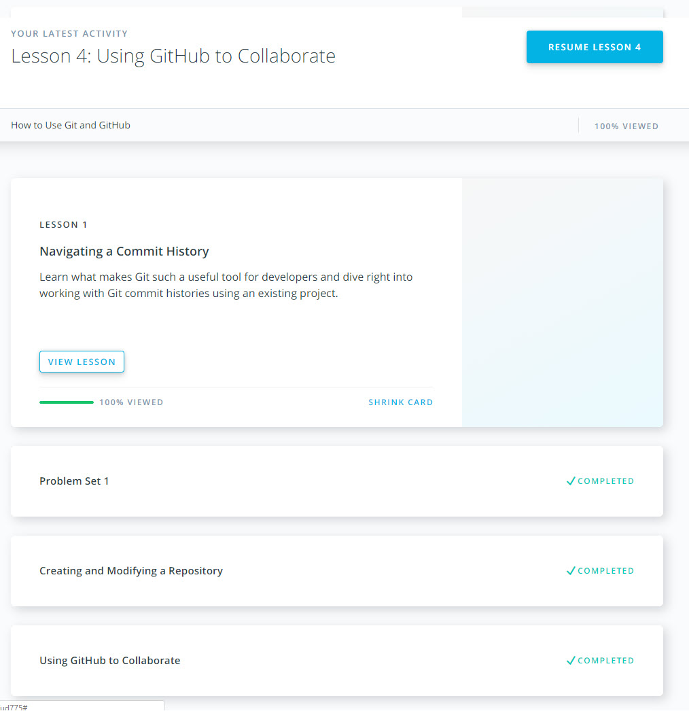
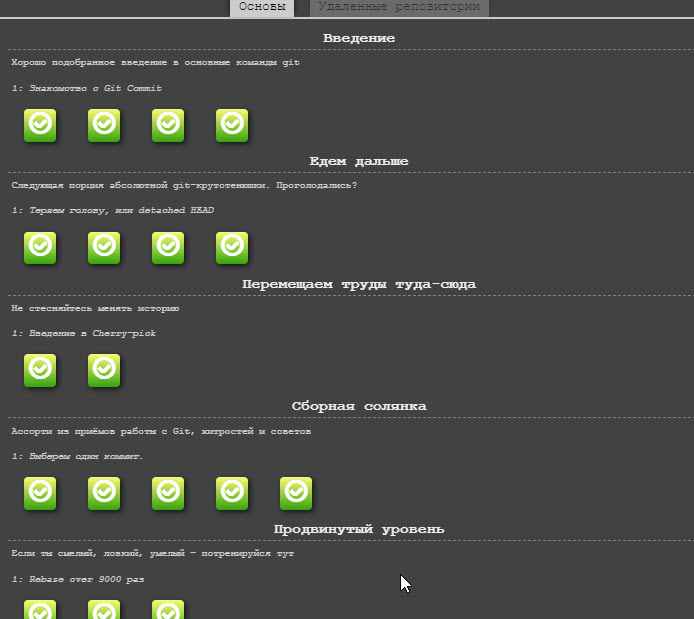
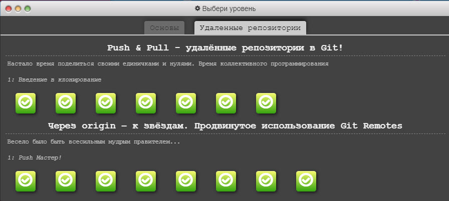

It was interesting and useful course for me about Git and Git Hub. It shows visually what probable problems could you have if you write incorrect command. Also I've known some new commands, which can be very helpful on real project: cherry-pick and rebase.

## Linux CLI, and HTTP
------ 
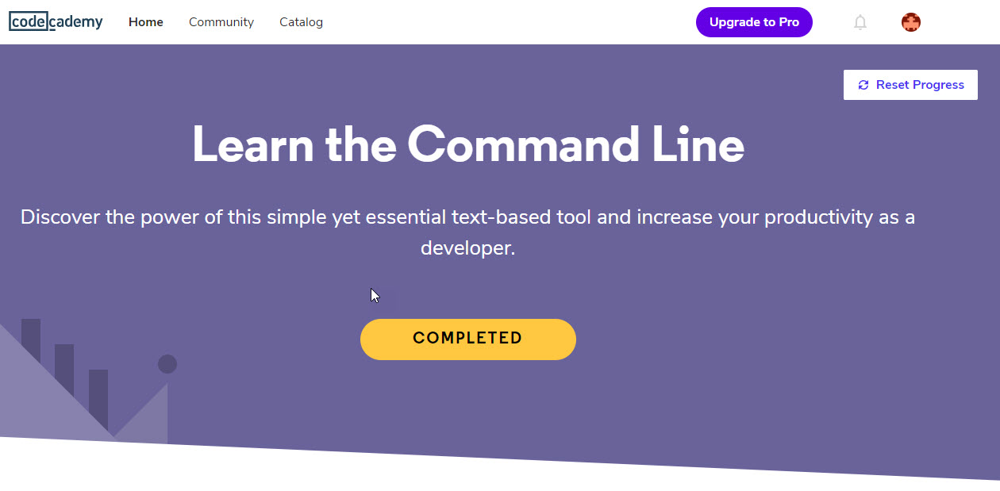

In this course I've learnt how to use nano editor, it was really new for me. Also I  have detailed knowledge of HTTP request and response headers, identification, authentication and caching. 

## Git Collaboration
------ 

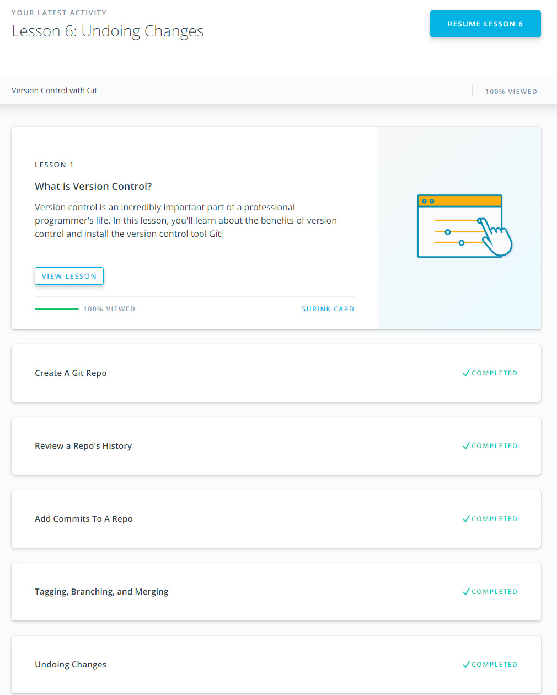

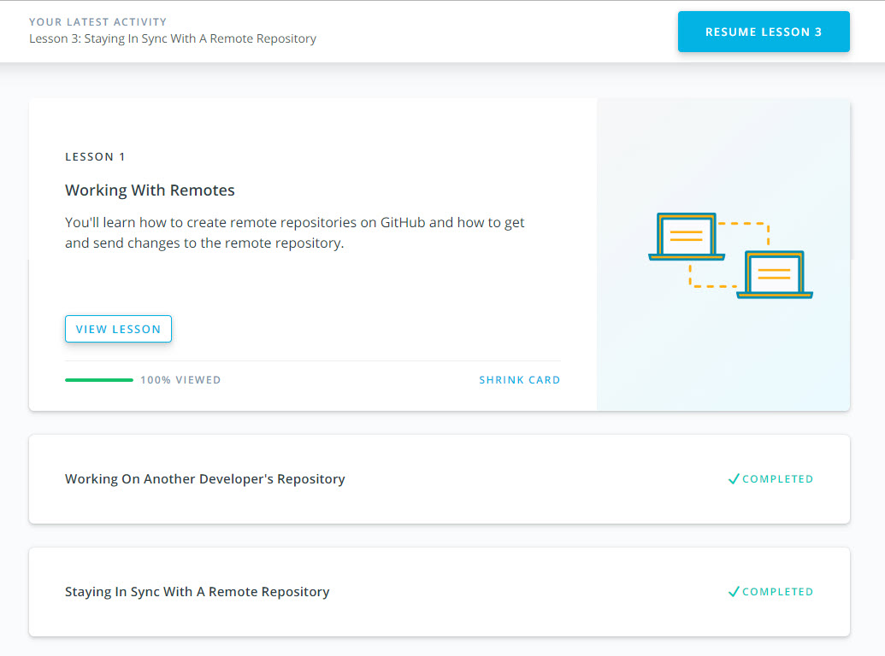

This course once again has shown us how powerful Git is for collaboration with other people on your project. Also I've known new flags for different commands. Now I know how easy we can find the right commit by its author or just by part of commit message.

## Intro to HTML and CSS
------

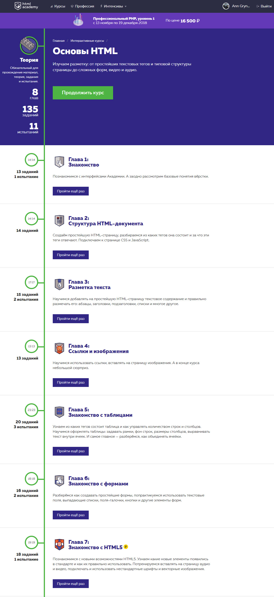
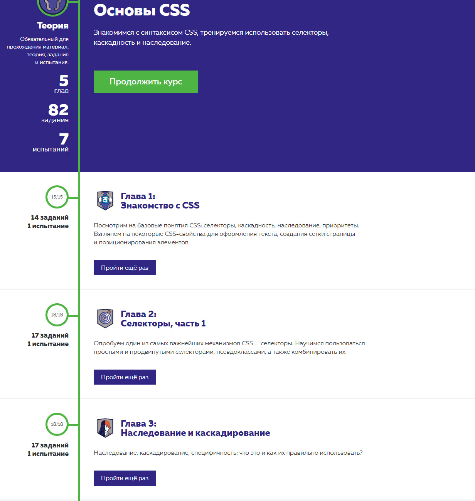

In this course I've reiterated the basics of HTML&CSS. Combination of different сontext and adjacent СSS selectors was interesting and new for me.

## Responsive Web Design
------

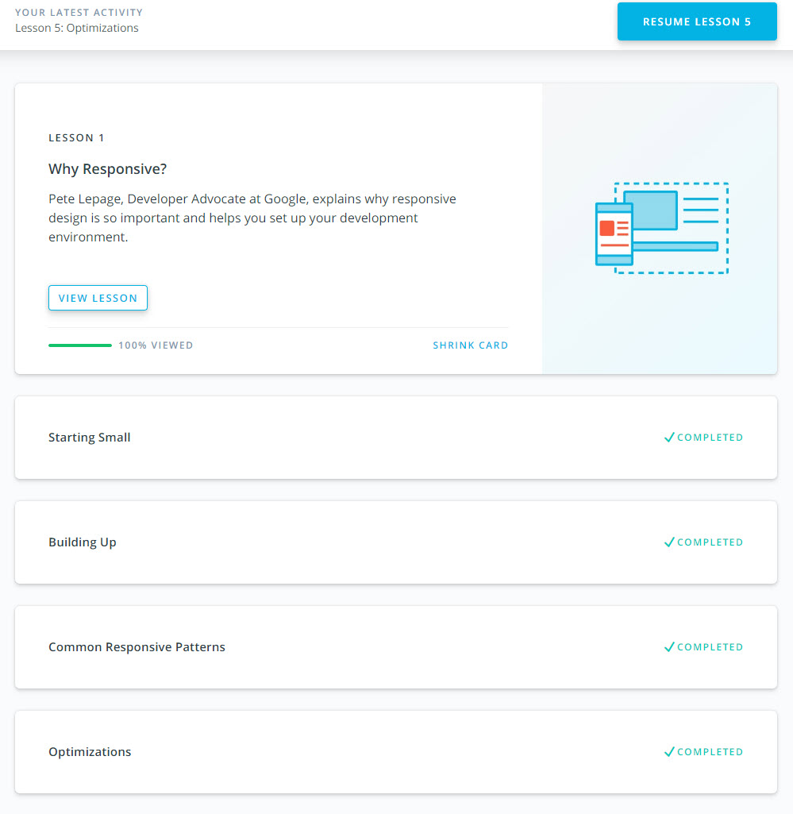
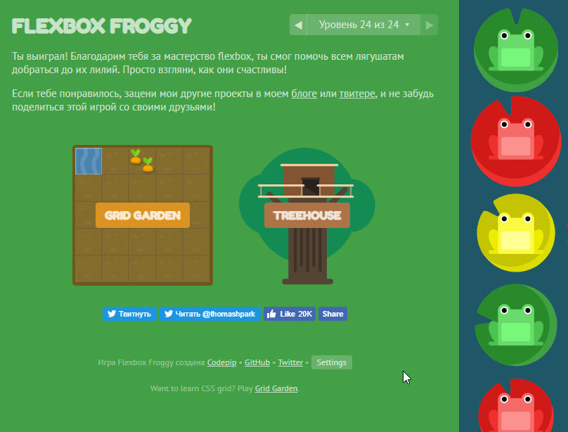

This course has reminded us how important is every detail in web design and also  has shown how we can manage layout.  Flex box is such a powerful tool for responsive layout. Also I've known some new information about responsive images.

## JS Basics
------

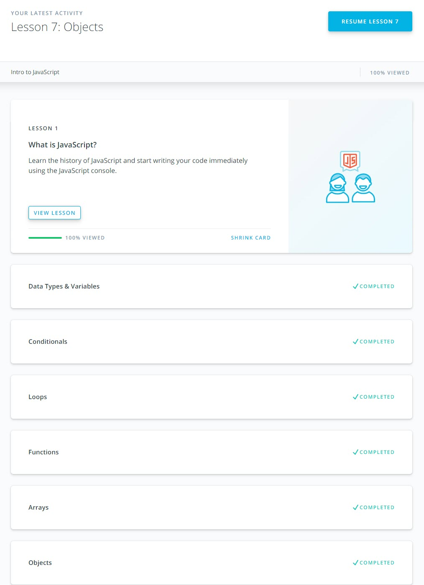
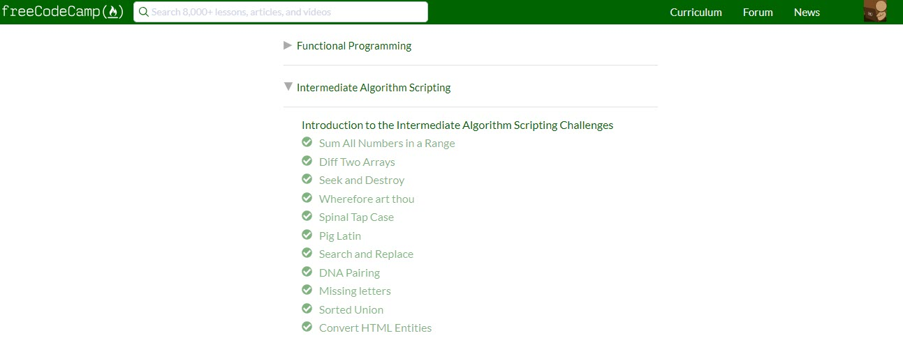
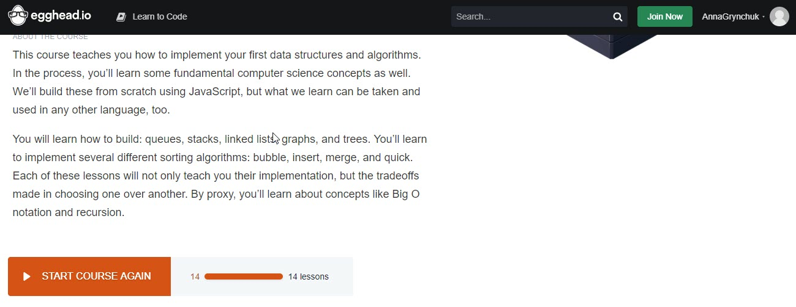

It was very useful and informative course for me. On freecodecamp I really was confused sometimes because I had no idea how it should work. Thanks to this course I've known new methods of array and string and understood how they can work together.

## DOM
------

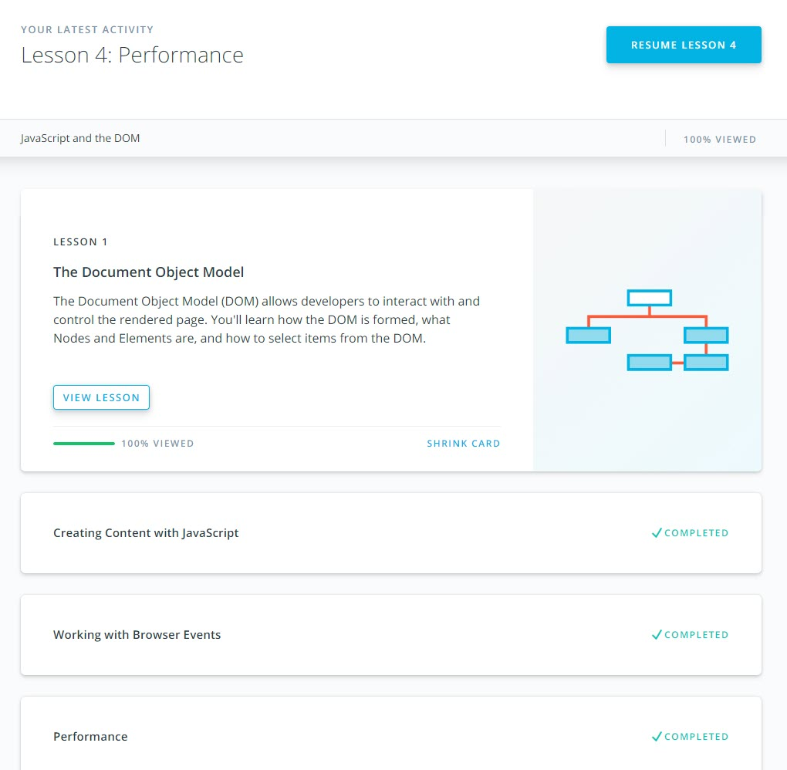
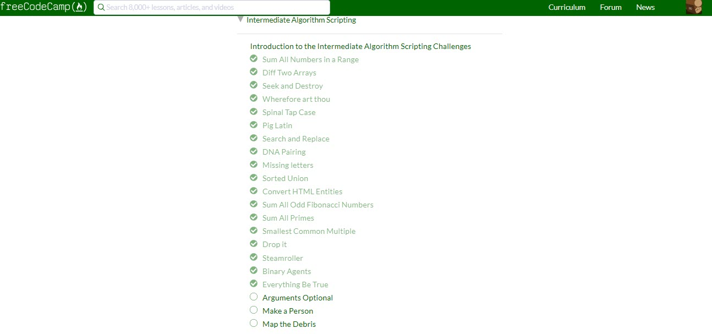

[Code base](https://github.com/kottans/frontend-2019-homeworks/tree/master/submissions/AnnGrynchuk/js_dom) | Reviewed and approved by @yevhenorlov

This course was a little difficult for me, I used hints on freecodecamp to complete tasks. Udacity course was very interesting and seemed quite simple, but when I start doing practical task everything has changed and I had a lot of fun :)

## A Tiny JS World
------

[Code base](https://github.com/kottans/frontend-2019-homeworks/tree/master/submissions/AnnGrynchuk/js_pre_oop) | Reviewed and approved by @OleksiyRudenko

This practical task was very helpful for me, I've known how properly reach the values of the objects and manipulate them.

## Object Oriented JS
------

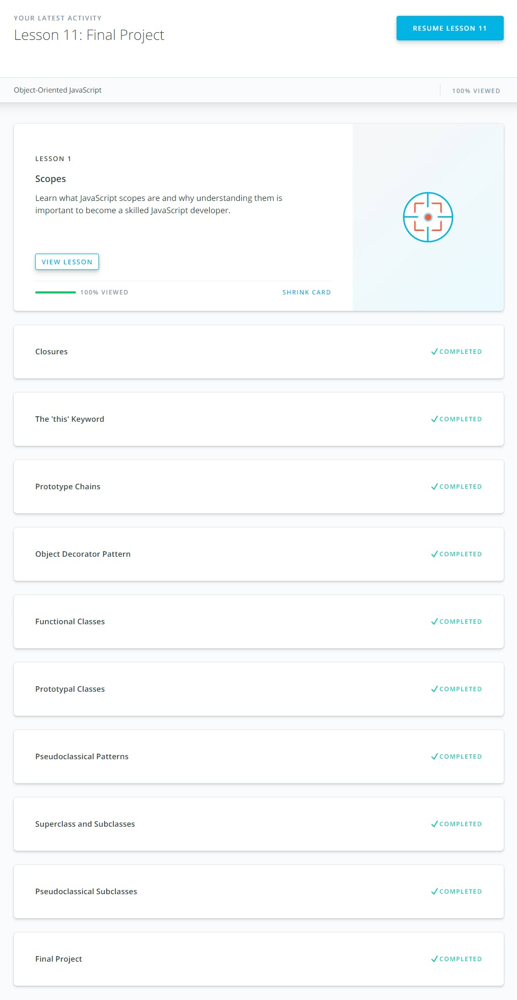
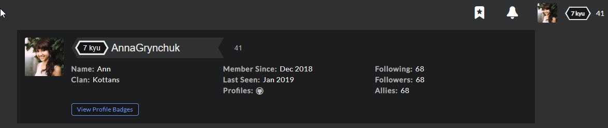

Udacity course about OOP was really entangled for me because much time was spent focusing on mistakes and for beginner it's hard to understand how you should write correct code. There was a lot of new and useful information, however. I think I just need more practice and time to handle this)
