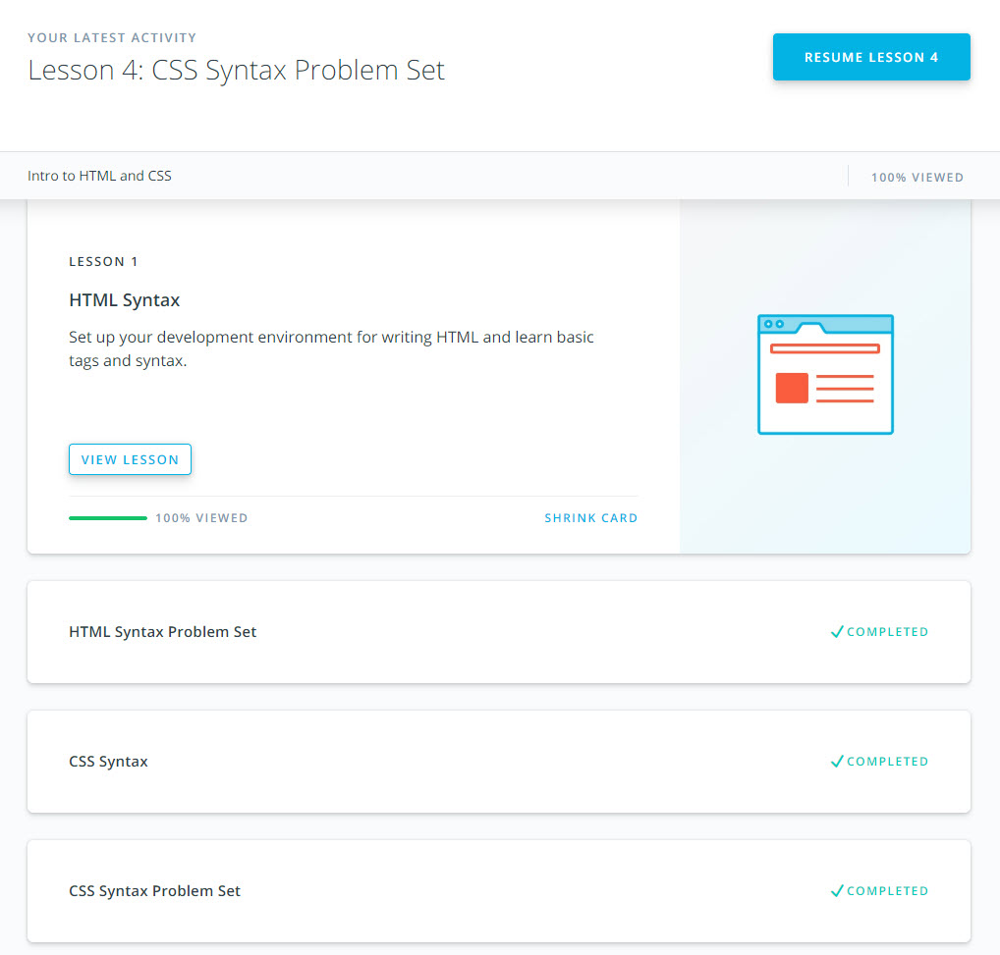

# kottans-frontend

Git & GitHub
------ 

It was interesting and useful course for me about Git and Git Hub. It shows visually what probable problems could you have if you write incorrect command. Also I've known some new commands, which can be very helpful on real project: cherry-pick and rebase.

## Linux CLI, and HTTP
------ 

In this course I've learnt how to use nano editor, it was really new for me. Also I  have detailed knowledge of HTTP request and response headers, identification, authentication and caching. 

## Git Collaboration
------ 

This course once again has shown us how powerful Git is for collaboration with other people on your project. Also I've known new flags for different commands. Now I know how easy we can find the right commit by its author or just by part of commit message.

## Intro to HTML and CSS
------

In this course I've reiterated the basics of HTML&CSS. Combination of different сontext and adjacent СSS selectors was interesting and new for me.
